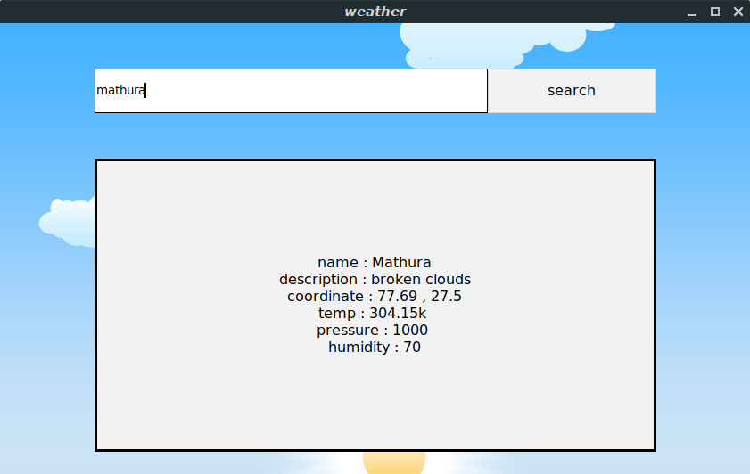

# weather
---

Python offers multiple options for developing GUI (Graphical User Interface). Out of all the GUI methods, tkinter is the most commonly used method. It is a standard Python interface to the Tk GUI toolkit shipped with Python. Python with tkinter outputs the fastest and easiest way to create the GUI applications. Now, it’s upto the imagination or necessity of developer, what he/she want to develop using this toolkit.

